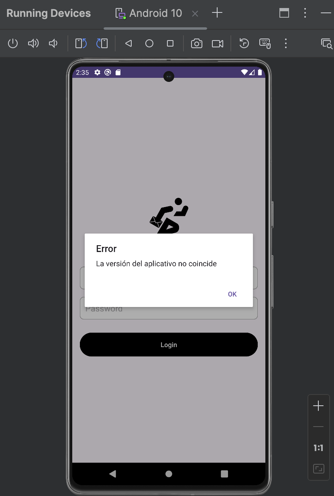

## Technologies ##

- _Kotlin_
- _XML_
- _Retrofit_
- _ViewModel_

## Views ##

| Project                                                                                                                                              |                                                      |
|:-----------------------------------------------------------------------------------------------------------------------------------------------------|------------------------------------------------------|
|  </img>    Control de Versiones   • Manejo de excepciones (Try/Catch)  •  Manejo de errores de consumo de API Rest  |  |
|                                                                                                                                                                                                                          
